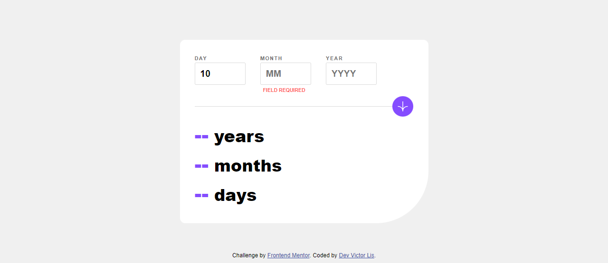

# Age Calculator App | Frontend Mentor - Challenge

Esse é mais um desafio de Front-End que realizo, dessa vez com o tema de realizar uma calculadora de idade.

## Desktop Design

## Desktop Result

## Mobile Design

## Mobile Result

## Hover Design

## Hover Result

## Invalid Num Design

## Invalid Num Result

## Empty Field Design

## Empty Field Result 

# Resultado
Veja o [site](https://age-calculator-by-dev-victor-lis.netlify.app/)!

## Autores

[@Victor-Lis]('https://github.com/Victor-Lis')
